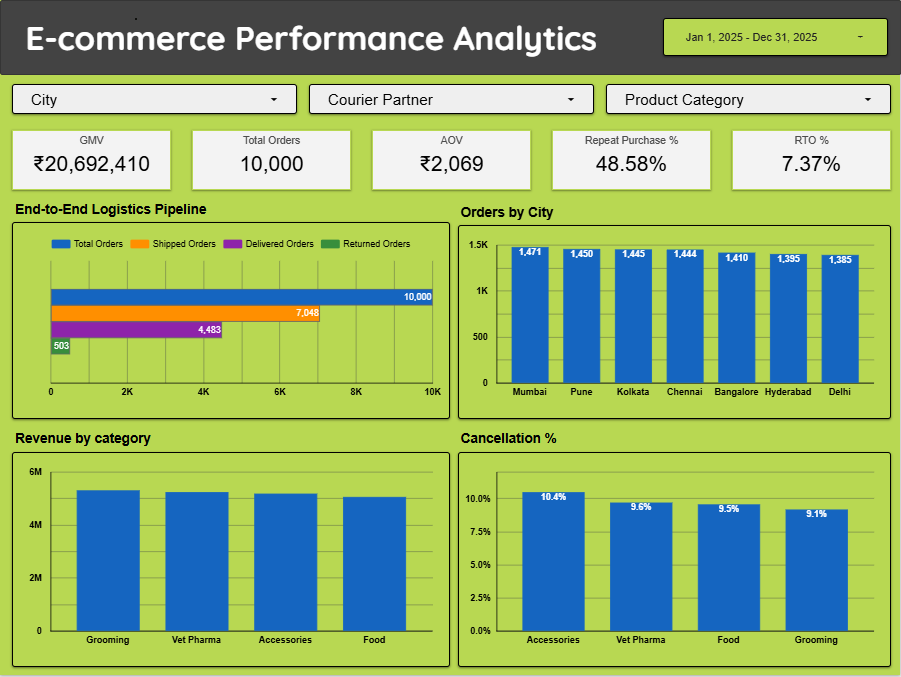

# E-commerce Data Analytics Case Study

## 📌 About the Project

This project is an end-to-end data analytics case study based on a real-world **E-commerce platform** (Supertails) operating in the D2C pet care space. \
The objective was to analyze customer behavior, communication effectiveness, logistics performance, and support operations to identify key business inefficiencies and growth opportunities.

The analysis spans the full funnel from order placement and communication engagement to delivery, support resolution, and customer retention using **MySql, Python, and Looker Studio.**

⚠️ Note: This project is presented as a generalized case study for portfolio purposes. All analysis focuses on problem-solving approach and insights rather than proprietary decision-making.

## 📂 Project Files

- 📄 **SQL – Business Metrics & Analysis**  
  Link to sql file - [business_metrics_analysis.sql](https://github.com/Safrin03/ecommerce-data-analytics-case-study/blob/5aea0051f79c1651cb748a27f06822618ce5e999/business_metrics_analysis.sql)

- 🐍 **Python – Data Cleaning & Exploratory Analysis**  
  Link to Notebook - [`data_cleaning_analysis.py`](https://github.com/Safrin03/ecommerce-data-analytics-case-study/blob/5aea0051f79c1651cb748a27f06822618ce5e999/data_cleaning_analysis.ipynb)

- 📊 **Looker Studio Dashboard**  
  Link to Dashboard - [E-commerce Performance Analytics Dashboard](https://lookerstudio.google.com/reporting/18a4f5bc-385b-487e-9d8d-d2477a554d92)

## 🔍 Project Summary

The analysis reveals that while the platform demonstrates strong revenue generation and customer retention, there are operational bottlenecks impacting customer experience and downstream metrics such as repeat purchase rate and CSAT.

**Key themes identified across SQL analysis, Python EDA, and dashboarding:**
- Customer experience is driven primarily by delivery reliability and communication effectiveness
- Early lifecycle churn (first 30–60 days) is a critical leakage point
- Logistics inefficiencies and courier-led delays significantly impact delivery success
- High-value customer segments exist but are under-leveraged
- Value-added services like Vet Consultations show strong outcomes but low adoption

## 🛠️ Approach & Methodology
**Tools Used :**
- **SQL** – Business metrics, cohort analysis, funnel analysis
- **Python** – Data cleaning, EDA, customer segmentation, supply chain analysis
- **Looker Studio** – Interactive dashboarding and KPI visualization

### 🔹 SQL Analysis -

**Focused on business logic and metric computation, using:**
- Multi-table JOINs
- CTEs for modular, readable queries
- Aggregations for KPIs 
- CASE WHEN for conditional classification
- Datetime functions for cohorting and retention analysis
- Logical segmentation for communication, logistics, and support workflows

**Key SQL analyses:**
- Order-to-Communication (O2C) performance
- Customer purchase & retention behavior
- Cohort-based retention analysis
- Delivery & supply chain performance
- Communication channel effectiveness
- Support ticket categorization & resolution metrics
- Vet consultation adoption analysis

### 🔹 Python Analysis -

**Used Pandas, Matplotlib, and Seaborn for:**
- Initial data inspection & validation
- Handling missing values and invalid records
- Standardizing data types and timestamps
- Exploratory Data Analysis (EDA)
- RFM-based customer segmentation
- City, category, and payment-mode analysis
- Supply chain and logistics diagnostics

**Key Python analyses:**
- Order value and revenue distribution
- City-level demand and performance
- Payment mode adoption
- Delivery TAT variability
- Communication engagement trends
- Weekly support ticket trends
- RFM segmentation and churn risk
- Shipment, SKU, and warehouse-level logistics insights

### 🔹 Looker Studio Dashboard - 

**Built an interactive performance dashboard with:**
- KPI scorecards (GMV, Orders, AOV, Repeat %, RTO %)
- End-to-end logistics funnel visualization
- City-level and category-level performance views
- Communication channel performance metrics
- Filters for date, city, courier, and category

## 📈 Key Results

**1. Overall Business Performance:**
- ₹20.69M GMV from 10,000 orders
- AOV: ₹2,069
- Repeat Purchase Rate: 48.6%
- RTO Rate: 7.37%

**2. Logistics Funnel:**
- Only ~44.8% of placed orders reach final delivery
- Significant drop between Shipped (7,048) and Delivered (4,483) orders
- Returns (~503 orders) contribute to operational leakage

**3. Customer & Communication Insights:**
- WhatsApp and Calls show marginally higher engagement
- O2C Connect % stabilizes around ~40% across channels
- Engagement drop occurs post-read → CTA effectiveness is the main opportunity

**4. Customer Segmentation (RFM):**
- Majority of customers fall into Bronze & Silver segments
- Gold customers show highest AOV but form a small base
- At-Risk customers have high historical spend but declining recency
- Small uplift in Bronze/Silver conversion could yield significant revenue

**5. Supply Chain Insights:**
- Shipment weight has near-zero correlation with delivery TAT
- Air vs Surface shipments show similar average delivery times
- No single warehouse bottleneck identified
- Delays driven by network-level and courier operations
- Small subset of SKUs show high RTO probability (early risk signals)

## 💡 Business Recommendations
**1️⃣ Improve Early Lifecycle Engagement:**

Focus retention efforts within **30–60 days post first purchase**.
Trigger onboarding nudges, delivery follow-ups, and first-repeat incentives.

**2️⃣ Reduce Courier-Led Delays:**

Prioritize performance reviews for **high-delay couriers**.
Even **2–3 hour improvements at scale** can materially improve OTD KPIs.
Introduce SLA-based courier routing for high-value orders.

**3️⃣ Optimize Communication Content (Not Channels):**

Channel performance is consistent; **message content & CTA** need optimization.
City-level personalization for high-volume, low-engagement metros.
Use WhatsApp & Calls for action-oriented nudges.

**4️⃣ Activate Vet Consultation Adoption:**

Surface vet consultations **post-delivery** via contextual nudges.
Bundle consultations with high-value categories (Vet Pharma, Grooming).
Leverage it as a retention and loyalty driver.

**5️⃣ Target High-Impact Customer Segments:**

Re-engage **At-Risk high-spend customers** with personalized offers.
Upsell Bronze & Silver customers using repeat-purchase incentives.
Protect Gold customers with loyalty benefits and proactive support.

